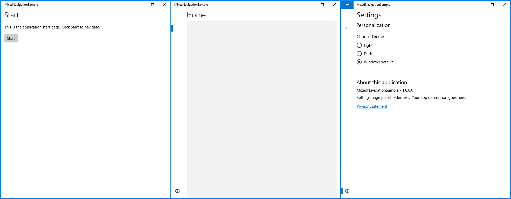

# App navigation

## NavigationService
The NavigationService is in charge of handling the navigation between app pages.

NavigationService has different implementation depending on the selected framework.
- **CodeBehind and MVVMBasic**
  - NavigationService is defined as a static class that uses Navigate method to navigate between pages using the target page type as a parameter.
- **MVVMLight**
  - ViewModelLocator instance the NavigationService and registers this instance on the instances container. NavigationServices needs to register the ViewModel associated with each page to can navigate using the ViewModel as a parameter.

```csharp
private NavigationServiceEx _navigationService = new NavigationServiceEx();

public ViewModelLocator()
{
    ServiceLocator.SetLocatorProvider(() => SimpleIoc.Default);

    Register<HomeViewModel, HomePage>();
    SimpleIoc.Default.Register(() => _navigationService);
}
```

## Navigation initialization
**App.xaml.cs** creates the **ActivationService** including the current App instance, the default navigation target type (page type for CodeBehind and MVVMBasic or ViewModel type for MVVMLight) and also allows to set any UIElement as a **navigation shell**. If shell is null, current window content will be initialized as a Frame.

Default navigation target will be passed to DefaultLaunchActivationHandler to set de default page.

```csharp
protected override async Task HandleInternalAsync(LaunchActivatedEventArgs args)
{
    // When the navigation stack isn't restored navigate to the first page,
    // configuring the new page by passing required information as a navigation
    // parameter
    NavigationService.Navigate(_navElement, args.Arguments);

    await Task.CompletedTask;
}
```

## Mixed navigation sample
In [this sample](../samples/navigation/MixedNavigationSample) we are going to create an app that includes a single start page before navigate to splitview shell page.

- Step 1. Navigate to Start Page on App.xaml.cs
```csharp
return new ActivationService(this, typeof(Views.StartPage));
```
- Step 2. Navigate to a ShellPage (Shell page will replace NavigationService Frame to a custom Frame) and then navigate to HomePage
```csharp
public class StartViewModel : Observable
{
  public ICommand StartCommand { get; set; }

  public StartViewModel()
  {
    StartCommand = new RelayCommand(OnStart);    
  }

  private void OnStart()
  {
    NavigationService.Navigate<Views.ShellPage>();
    NavigationService.Navigate<Views.HomePage>();
  }
}
```

Here is the navigation flow on this sample:

