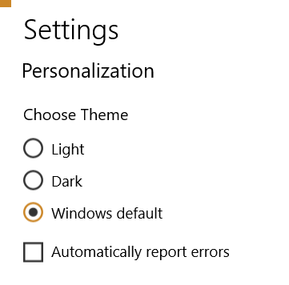

# Settings Page

By default the settings page contains a single boolean setting to track whether the app should be displayed with the Light or Dark theme.

## Add another boolean setting

Let's add a boolean setting to control whether errors should be automatically reported.
Adding a setting requires you to:

* Update the View so it's possible to see and change the setting
* Update the ViewModel to add logic related to changing the setting.

### Update the View

The default code uses a `ToggleSwitch` to control the theme. It's possible to use another `ToggleSwitch` for our new setting but we'll use a `CheckBox` to show an alternative.

Add the following below the `ToggleSwitch` inside the `StackPanel` in **SettingsView.xaml**.

```xml
<CheckBox IsChecked="{x:Bind ViewModel.IsAutoErrorReportingEnabled, Mode=TwoWay}"
          x:Uid="Settings_EnableAutoErrorReporting"
          Margin="0,8,0,0" />
```

Add an entry to **Strings/en-us/Resources.resw**

Name: Settings_EnableAutoErrorReporting.Content  
Value: Automatically report errors

When run it will now look like this:



But if you try and run it now you will get build errors as the ViewModel hasn't been updated to add the new property.

### Update the ViewModel

The `IsLightThemeEnabled` property uses a static `ThemeSelectorService`. It is not necessary to create equivalent services for every setting but is appropriate for the theme preference as this is needed when the app launches.

Because we may want to access settings in various parts of the app it's important that the same settings values are used in all locations. The simplest way to do this is to have a single instance of the `SettingsViewModel` and use it for all access to settings values.

The generated code in includes a Singleton helper class to provide access to a single instance of the view model which we can use everywhere.

With this knowledge we can now add the new property for accessing our stored setting. We also need to add a new, awaitable initializer for the property too.
Add the following to **SettingsViewModel.cs**

```csharp
using {YourAppName}.Helpers;
using System.Threading.Tasks;


private bool? _isAutomaticErrorReportingEnabled;

public bool? IsAutoErrorReportingEnabled
{
    get => _isAutomaticErrorReportingEnabled ?? false;

    set
    {
        if (value != _isAutomaticErrorReportingEnabled)
        {
            Task.Run(async () => await Windows.Storage.ApplicationData.Current.LocalSettings.SaveAsync(nameof(IsAutoErrorReportingEnabled), value ?? false));
        }

        Set(ref _isAutomaticErrorReportingEnabled, value);
    }
}

private bool _hasInstanceBeenInitialized = false;

public async Task EnsureInstanceInitializedAsync()
{
    if (!_hasInstanceBeenInitialized)
    {
        IsAutoErrorReportingEnabled =
            await Windows.Storage.ApplicationData.Current.LocalSettings.ReadAsync<bool>(nameof(IsAutoErrorReportingEnabled));

        Initialize();

        _hasInstanceBeenInitialized = true;
    }
}
```

Then change the constructor to match this:

```csharp
public SettingsViewModel()
{
    SwitchThemeCommand = new RelayCommand(async () =>
    {
        if (_hasInstanceBeenInitialized)
        {
            await ThemeSelectorService.SwitchThemeAsync();
        }
    });
}
```

We must now update our uses of the ViewModel. In **SettingsView.xaml.cs** change the `OnNavigatedTo()` method so that instead of calling the old Initialize method, like this:

```csharp
protected override void OnNavigatedTo(NavigationEventArgs e)
{
    ViewModel.Initialize();
}
```

It now awaits the call to the new Initializer like this:

```csharp
protected override async void OnNavigatedTo(NavigationEventArgs e)
{
    await ViewModel.EnsureInstanceInitializedAsync();
}
```

Everything is now complete and you can run the app and it will remember the value between invocations of the app.

### Accessing the setting from elsewhere in the app

If you want to access the property elsewhere in the app, ensure you have called `await ServiceLocator.Current.GetInstance<SettingsViewModel>().EnsureInstanceInitializedAsync();`. Then you can get or set the property with `ServiceLocator.Current.GetInstance<SettingsViewModel>().IsAutoErrorReportingEnabled`.
For example:

```csharp
try
{
    ...
}
catch (Exception exc)
{
    await ServiceLocator.Current.GetInstance<SettingsViewModel>().EnsureInstanceInitializedAsync();
    if (ServiceLocator.Current.GetInstance<SettingsViewModel>().IsAutoErrorReportingEnabled)
    {
        // Send the error details to the server
    }
}
```

If you only use the value in one or two places you could call `EnsureInstanceInitializedAsync()` each time before you access the SettingsViewModel instance. But, as `EnsureInstanceInitializedAsync()` only needs to be called once before it is used, if you have lots of settings or need to access them in many places you could call it once as part of the `InitializeAsync()` method in **ActivationService.cs**.
