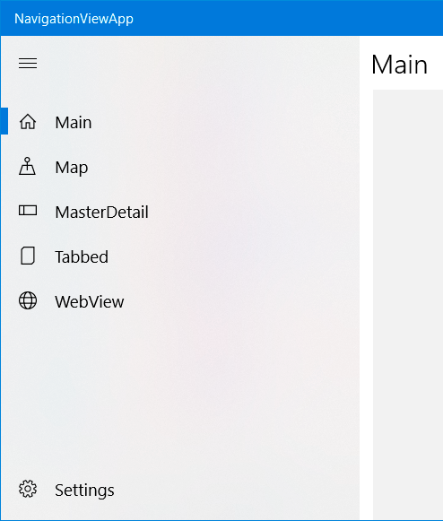

# Navigation Pane

:heavy_exclamation_mark: There is also a version of [this document with code samples in C#](./navigationpane.md) :heavy_exclamation_mark: |
----------------------------------------------------------------------------------------------------------------------------------------- |

The navigation pane project type includes a navigation menu displayed in a panel at the side of the screen and which can be expanded with the Hamburger icon.

This document covers:

* [Modifying the menu items](#menu)
* [Using the navigation pane with command bars](#commandbar)
* [Have the menu item invoke code rather than navigate](#invokecode)

To update to navigation view read the following [document](updatetonavigationview.md).

<a name="menu"></a>

## Modifying the menu items

The menu can be modified in the following ways.

* Change the icon for an item in the navigation panel menu
* Change the text for an item in the navigation panel menu

### Change the icon for an item

By default every item in the navigation pane is displayed with the symbol for a document.
When every item has the same icon it is hard to differentiate between them when the navigation panel is collapsed. In almost all cases you will want to change the icon used.



Navigate to `Views/ShellPage.xaml` and change the `NavigationViewItems` in the `NavigationView MenuItems` property.

The code below shows the symbols used to create the app shown in the image above.

```xml
<NavigationView.MenuItems>
    <!--
    TODO WTS: Change the symbols for each item as appropriate for your app
    More on Segoe UI Symbol icons: https://docs.microsoft.com/windows/uwp/style/segoe-ui-symbol-font
    Or to use an IconElement instead of a Symbol see https://github.com/Microsoft/WindowsTemplateStudio/blob/master/docs/projectTypes/navigationpane.md
    Edit String/en-US/Resources.resw: Add a menu item title for each page
    -->
    <NavigationViewItem
        x:Uid="Shell_Main"
        Icon="Home"
        helpers:NavHelper.NavigateTo="views:MainPage" />
    <NavigationViewItem
        x:Uid="Shell_Map"
        Icon="Map"
        helpers:NavHelper.NavigateTo="views:MapPage" />
    <NavigationViewItem
        x:Uid="Shell_MasterDetail"
        Icon="DockLeft"
        helpers:NavHelper.NavigateTo="views:MasterDetailPage" />
    <NavigationViewItem
        x:Uid="Shell_Tabbed"
        Icon="Document"
        helpers:NavHelper.NavigateTo="views:TabbedPage" />
    <NavigationViewItem
        x:Uid="Shell_WebView"
        Icon="Globe"
        helpers:NavHelper.NavigateTo="views:WebViewPage" />
</NavigationView.MenuItems>
```

The icons are created using the `Windows.UI.Xaml.Controls.Symbol` enumeration. You can view all the symbols available at <https://docs.microsoft.com/en-us/uwp/api/windows.ui.xaml.controls.symbol>

You can also set the menu item to use an `IconElement` directly. Like this:

```xml
<NavigationView.MenuItems>
    <NavigationViewItem x:Uid="Shell_Map" helpers:NavHelper.NavigateTo="views:MapPage">
        <NavigationViewItem.Icon>
            <FontIcon FontFamily="Segoe MDL2 Assets" Glyph="&#xE707;" />
        </NavigationViewItem.Icon>
    </NavigationViewItem>
</NavigationView.MenuItems>
```

### Change the text for an item

The text for a shell navigation item comes from the localized string resources. For an item which defines the x:Uid `Shell_Main` the value `Shell_Main.Content` corresponds with an entry in `Resources.resw`. Change the value in the resources file to alter what is displayed in the navigation menu.

<a name="commandbar"></a>

## Using the navigation pane and command bars

The following is intended as an aid to anyone wanting to add a `CommandBar` to one or all pages in an app using a Navigation Pane.

### Avoid page.TopAppBar and page.BottomAppBar

Each page has a property for `TopAppBar` and `BottomAppBar` intended to hold a `CommandBar`. Despite their names, they put the CommandBar at the top (or bottom) of the window, not the Page that declares it. Because the NavigationPane works by putting a page within the ShellPage this causes the CommandBar to overlap with the NavigationView and is not desirable. Instead use one of the techniques shown below.

### Adding a CommandBar to a single page

Because of the issue identified above, to add a `Commandbar` to the **bottom** of a single page, simply position it at the bottom of the grid intended for displaying content.

```xml
    <Grid 
        Grid.Row="1" 
        Background="{ThemeResource SystemControlPageBackgroundChromeLowBrush}">
        <!--The SystemControlPageBackgroundChromeLowBrush background represents where you should place your content. 
            Place your content here.-->

        <CommandBar VerticalAlignment="Bottom">
            <AppBarButton x:Uid="AdminButton" Icon="Admin" />
        </CommandBar>
    </Grid>
```

If adding the bar at the **top** of the page it can incorporate the page's title text in the content area. Like this:

```xml
    <Grid.RowDefinitions>
        <RowDefinition x:Name="TitleRow" Height="Auto" />
        <RowDefinition Height="*"/>
    </Grid.RowDefinitions>

    <CommandBar>
        <CommandBar.Content>
            <Grid>
                <TextBlock
                    x:Name="TitlePage"
                    x:Uid="Main_Title"
                    Text="Navigation Item 2"
                    Style="{StaticResource PageTitleStyle}" />
            </Grid>
        </CommandBar.Content>
        <AppBarButton Icon="Add" Label="Add" />
    </CommandBar>
```

### Adding a CommandBar to every page in the app

By adding a CommandBar to the `ShellPage` it is visible when navigating to any page.

To add `CommandBar` at the bottom of every page, modify the contents of `ShellPage.xaml` to add a `Grid` around the `NavigationView` and also include a `CommandBar`.

```xml
    <Grid>
        <Grid.RowDefinitions>
            <RowDefinition Height="*" />
            <RowDefinition Height="Auto" />
        </Grid.RowDefinitions>
        <NavigationView>
            <!--  Contents of NavigationView menu omitted to brevity  -->
        </NavigationView>
        <CommandBar Grid.Row="1">
            <AppBarButton Icon="Camera" Label="Picture" />
        </CommandBar>
    </Grid>
```

The above approach can be used to put the bar above the `NavigationView` by swapping the rows in the grid.
Alternatively, a bar can be added inside the NavigationView using the HeaderTemplate.

```xml
<NavigationView>
    <!--  Contents of NavigationView menu omitted to brevity  -->
    <NavigationView.HeaderTemplate>
        <DataTemplate>
            <Grid>
                <Grid.ColumnDefinitions>
                    <ColumnDefinition Width="Auto" />
                    <ColumnDefinition Width="*" />
                </Grid.ColumnDefinitions>
                <CommandBar Grid.ColumnSpan="2">
                    <AppBarButton Icon="Save" Label="Save" />
                </CommandBar>
                <TextBlock
                    Style="{StaticResource TitleTextBlockStyle}"
                    Margin="12,0,0,0"
                    VerticalAlignment="Center"
                    Text="{Binding Selected.Content}" />
            </Grid>
        </DataTemplate>
    </NavigationView.HeaderTemplate>
<NavigationView>
```

**A Note about the above code examples.**

Events and commands are not shown in the above code but can easily be added like any other button click event or command. Note that if using the techniques for adding the bar to every page, the events or commands should be handled by the ShellPageViewModel (or in ShellPage.xaml.vb if using CodeBehind.)

In all the above code examples the `Label` values have been hard-coded. This is to make the samples simpler. To use localized text, set the `x:Uid` value for the `AppBarButton` and add a corresponding resource entry for "{name}.Label".

The examples also only show a single `AppBarButton` being added. This is to keep the code sample as simple as possible but you can add any appropriate content to the bar, as [documented here](https://docs.microsoft.com/en-us/windows/uwp/controls-and-patterns/app-bars).

<a name="invokecode"></a>

## Invoke code on NavigationView

Extending the app to add this functionality requires making two changes.

1. Add a HyperLink in the FooterTemplate.
2. Add a Command to handle code on HyperLink click.

**ShellPage.xaml**
```xml
<NavigationView>
    <NavigationView.PaneFooter>
        <StackPanel>
            <HyperlinkButton
                x:Uid="Shell_ShowInfo"
                Margin="16,0"
                Command="{x:Bind ViewModel.ShowInfoCommand}" />
        </StackPanel>
    </NavigationView.PaneFooter>
</NavigationView>
```

Add a command to run the code in `ShellViewModel.vb` (MVVMBasic or MVVMLight) or `ShellPage.xaml.vb` (CodeBehind)
```vbnet
    Private _showInfoCommand as ICommand
    Public Property ShowInfoCommand As ICommand
        Get
            Return If(_showInfoCommand, (__InlineAssignHelper(_showInfoCommand, New RelayCommand(OnShowInfo)))
        End Get
    End Property

    Private Sub OnShowInfo()
        'TODO: Run command code
    End Sub
```